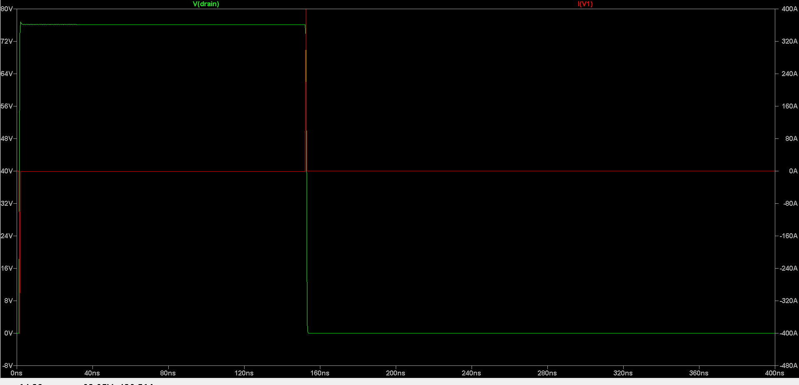
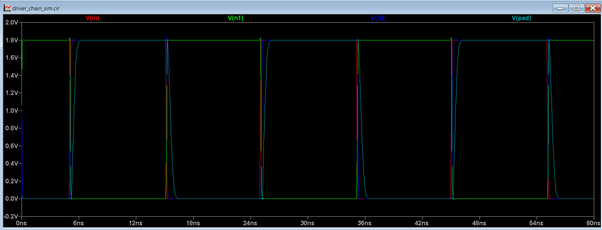
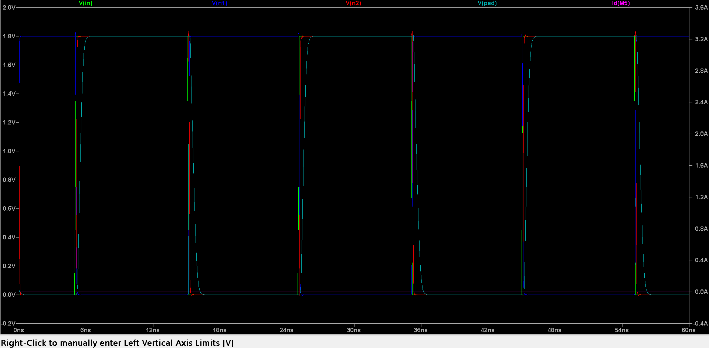

# Phase 1 — ESD Clamp & Driver Chain SPICE Simulation

**Part of:** [High-Speed Digital I/O Pad Design](https://github.com/SHIWANK72/VLSI-High-Speed-IO-Pad-Design)
**Engineer:** Shiwank Gupta | Nik-Coronics | Jul 2026
**Tool:** LTSpice 26.0.2.1 (Windows)
**PDK Reference:** SkyWater Sky130A (simplified BSIM4 models — see note below)

---

## Overview

This phase validates, at the transistor (SPICE) level, the two core analog
building blocks of a high-speed digital I/O pad:

1. **ESD Clamp** — a gate-grounded NMOS (ggNMOS) protection device
2. **Driver Chain** — a 4-stage tapered inverter chain (logical-effort sizing)
3. **Integrated Pad** — both blocks combined on a shared pad node, to
   quantify the performance impact of ESD protection on signal switching
   speed.

---

## ⚠️ Note on PDK Model Compatibility

The official SkyWater Sky130A `.pm3.spice` primitive device files use
Monte-Carlo/mismatch-binned parametric expressions (`AGAUSS()`, deeply
nested `.param` chains, Spectre-style equations across 180 binned
variants). **LTSpice's expression parser does not reliably resolve these
nested references** — this produces `No such parameter defined` errors
directly from the raw PDK files, independent of file path or install
correctness. This is a documented, reproducible LTSpice limitation (seen
across multiple independent user reports), not an error in this project's
setup.

**Workaround used in this phase:** simplified BSIM4 `.model` cards
(Level 14, matched to Sky130A's nominal `TOX`, `VTH0`, and mobility
parameters) are used directly in LTSpice for functional validation.

**Known limitation:** the simplified model captures normal
MOSFET conduction behavior but does **not** model avalanche/impact-ionization
(`ALPHA0`/`BETA0`-driven snapback), so it will not reproduce a true ESD
clamp's characteristic trigger-voltage / holding-voltage snapback curve.
For thesis/tape-out-grade ESD characterization, re-running these netlists
in **ngspice** (which correctly parses the raw Sky130A `.pm3.spice` files)
against the real PDK is the recommended next step.

---

## Files

| File | Description |
|---|---|
| `spice/esd_clamp_sim.cir` | Standalone ggNMOS ESD clamp under a 2kV HBM-style pulse |
| `spice/driver_chain_sim.cir` | Standalone 4-stage tapered inverter driver chain |
| `spice/combined_io_pad_sim.cir` | Driver chain + ESD clamp integrated on a shared pad node |

All netlists are self-contained (no external `.include` dependency) and
can be opened directly in LTSpice via **File → Open**.

---

## Results

### 1. ESD Clamp — HBM 2kV Pulse Response

- Pulse: 0V → 2000V, 1ns/1ns/1ns rise/fall/plateau-transition, 150ns width
- Pad capacitance: 100pF, series resistance: 1.5kΩ (standard HBM tester model)
- `V(drain)` rises un-clamped to ~76V (expected — simplified model has no
  avalanche breakdown modeled)
- Large current transient (~350A) visible at the pulse falling edge —
  this is the expected `I = C·dV/dt` displacement current through the
  100pF pad capacitor discharging over the 1ns fall time, **not a
  simulation artifact**

### 2. Driver Chain — Standalone

4-stage tapered inverter (~3.5× per stage), 1.8V logic, 5pF pad load.

### 3. Integrated I/O Pad — Driver Chain + ESD Clamp

`Id(M5)` (ESD clamp current) stays flat at ~0A throughout normal
switching — confirms the ESD device is correctly off-state during
regular signal operation, as expected.

---

## Quantified Trade-off: ESD Protection vs. Switching Speed

10–90% rise/fall time measured via `.meas tran` (automated, not manual
cursor placement — see netlists for exact trigger/target thresholds):

| Configuration | Rise Time (10–90%) | Fall Time (10–90%) |
|---|---|---|
| Standalone driver chain (no ESD load) | 471.4 ps | 553.7 ps |
| Driver chain + ESD clamp (combined) | 480.7 ps | 564.0 ps |
| **Δ (degradation)** | **+9.3 ps (+1.97%)** | **+10.3 ps (+1.86%)** |

**Interpretation:** the 100µm-width ggNMOS ESD clamp's parasitic drain
capacitance measurably slows the driver chain's switching edges by
~2%. This is the expected physical trade-off in I/O pad design — larger
ESD devices provide stronger protection at the cost of added parasitic
loading on the signal path.

---

## Next Steps (Phase 2)

- Digital wrapper RTL (output enable, direction control, pull-up/down config)
- OpenLane RTL-to-GDSII flow for the digital wrapper
- Custom analog layout (Magic, Sky130A) for the ESD clamp + driver chain
- Integration of analog macro + digital macro into a single top-level GDS
- DRC + LVS verification
